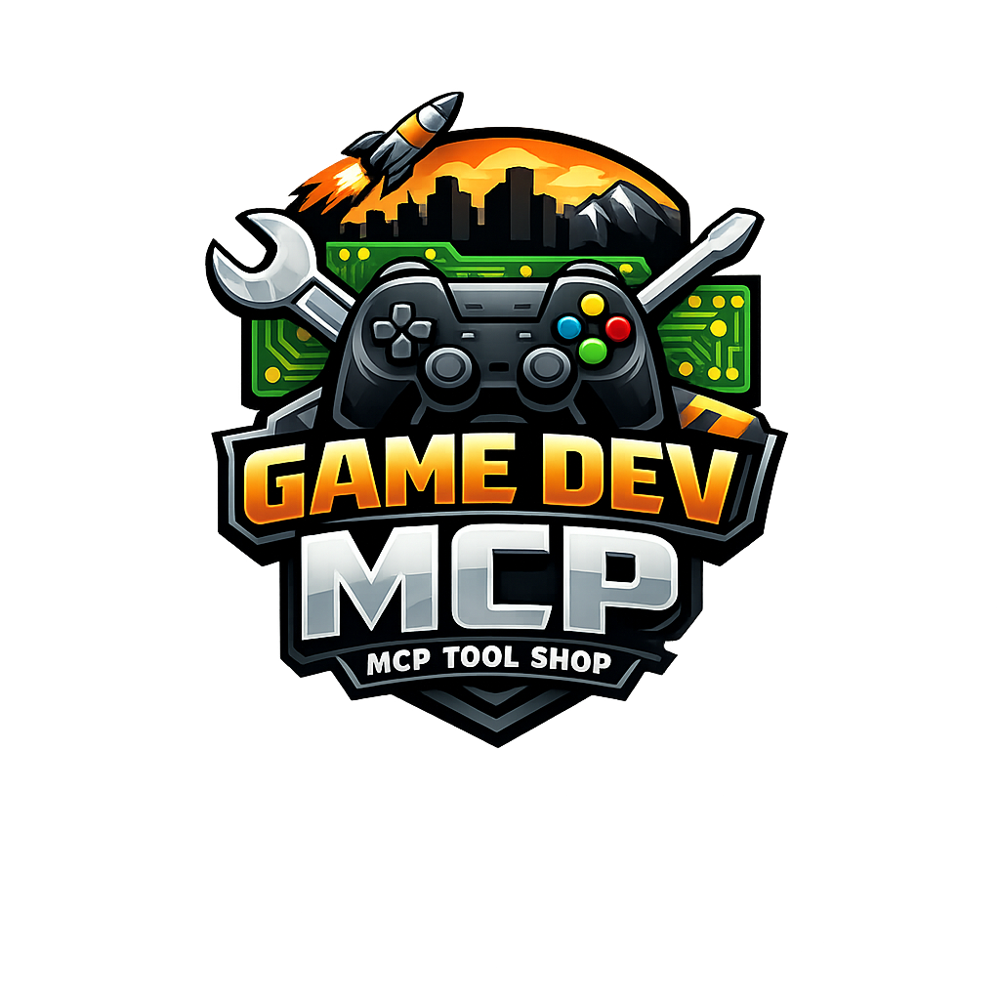

<p align="center">
  <a href="README.md">English</a> | <a href="README.ja.md">日本語</a> | <a href="README.zh.md">中文</a> | <a href="README.es.md">Español</a> | <a href="README.fr.md">Français</a> | <a href="README.hi.md">हिन्दी</a> | <strong>Italiano</strong> | <a href="README.pt-BR.md">Português</a>
</p>

<p align="center">
  
</p>

<h1 align="center">game-dev-mcp</h1>

<p align="center">
  Parla con il tuo motore di gioco. Crea attori, costruisci livelli, regola proprietà — tutto attraverso conversazione naturale con qualsiasi LLM.
</p>

<p align="center">
  <a href="#avvio-rapido">Avvio Rapido</a> &middot;
  <a href="#cosa-può-fare">44 Strumenti</a> &middot;
  <a href="#libreria-di-conoscenza">Libreria</a> &middot;
  <a href="HANDBOOK.md">Manuale</a>
</p>

---

Attualmente supporta **Unreal Engine 5** tramite la Remote Control API integrata. Nessun plugin di terze parti. Nessuna compilazione C++. Basta abilitare l'API e iniziare a parlare.

## Come ci si sente?

> **Tu:** Crea una luce puntuale sopra il tavolo e rendila calda

Il LLM chiama `ue_spawn_actor`, imposta la posizione, regola la temperatura colore con `ue_set_property` — e la luce appare nel tuo viewport. Continui a parlare, continua a costruire.

## Avvio Rapido

### 1. Abilitare Remote Control API in UE5

1. Apri il tuo progetto UE5 (5.4+)
2. **Modifica > Plugin** → cerca "Remote Control API" → Abilita
3. Riavvia l'editor

Questo plugin è già incluso in UE5 — stai solo attivandolo.

### 2. Installazione e configurazione

```bash
npx @mcptoolshop/game-dev-mcp
```

Aggiungi alla configurazione del tuo client MCP (es. `claude_desktop_config.json` di Claude Desktop):

```json
{
  "mcpServers": {
    "gamedev": {
      "command": "npx",
      "args": ["@mcptoolshop/game-dev-mcp"]
    }
  }
}
```

### 3. Test

Chiedi al tuo LLM: **"Fai un ping a Unreal Engine"** — chiamerà `ue_ping` e confermerà la connessione.

## Cosa può fare?

### Attori (9 strumenti)
Creare, eliminare, duplicare, trasformare, elencare, cercare e selezionare attori nel livello. Funziona con qualsiasi classe di attore — mesh, luci, telecamere, volumi.

### Proprietà (4 strumenti)
Leggere e scrivere qualsiasi UPROPERTY su qualsiasi UObject. Usa `ue_describe_object` per scoprire cosa è disponibile, poi ottieni o imposta esattamente ciò che ti serve.

### Asset (8 strumenti)
Cercare nel browser dei contenuti, elencare directory, verificare l'esistenza, duplicare, rinominare, eliminare e salvare asset.

### Livelli (4 strumenti)
Salvare il livello corrente, caricarne uno diverso, ottenere informazioni sul livello, o salvare tutti i pacchetti modificati in una volta.

### Blueprint (5 strumenti)
Creare classi Blueprint da zero, aggiungere componenti, configurare le loro proprietà, compilare e istanziare — tutto attraverso la conversazione.

### Editor (4 strumenti)
Testare la connessione, eseguire comandi console, ottenere informazioni sul motore e puntare la vista su qualsiasi attore.

### Conoscenza (1 strumento)
Cercare tra 35 tutorial UE5 integrati on-demand — così il tuo LLM può consultare come funziona Nanite o cos'è un Behavior Tree durante la conversazione.

### Progetto (7 strumenti)
Memorizzare convenzioni, note e contesto specifici del progetto in `.game-dev-mcp/` in modo persistente tra le sessioni.

### Missione (2 strumenti)
Monitoraggio del progresso durante operazioni multi-step. Si integra con [mcp-aside](https://github.com/mcp-tool-shop-org/mcp-aside) per notifiche in tempo reale.

**Totale: 44 strumenti**

## Libreria di Conoscenza

Il server include 35 tutorial come risorse MCP. Il tuo LLM li legge on-demand — nessun contesto sprecato finché non ha effettivamente bisogno dell'informazione:

| Categoria | Contenuto |
|-----------|-----------|
| **Inizio** | Configurazione, primi comandi, struttura del progetto |
| **Attori** | Creazione, trasformazioni, riferimento tipi, componenti |
| **Asset** | Browser dei contenuti, modelli di ricerca, importazione |
| **Blueprint** | Basi, creazione, configurazione dei componenti |
| **Livelli** | Gestione, composizione del mondo |
| **Materiali** | Basi, istanze di materiali |
| **Illuminazione** | Tipi di luce, flusso di lavoro |
| **Fisica** | Simulazione, collisioni, vincoli |
| **Audio** | Sound cue, attenuazione, audio spaziale |
| **Animazione** | Mesh scheletrica, AnimBP, montaggi |
| **Effetti Visivi** | Particelle Niagara, simulazione GPU |
| **Rendering** | Nanite, Lumen, mappe d'ombre virtuali |
| **IA e Navigazione** | NavMesh, alberi comportamentali, EQS |
| **Cinematiche** | Sequencer, telecamere, rendering cinematografico |
| **Assistente Virtuale** | Assistenti MetaHuman, integrazione LLM |
| **Riferimento API** | Remote Control API, riferimento sottosistemi |
| **Modelli** | Flussi di lavoro comuni, gestione errori, prestazioni |

## Conoscenza del Progetto

Il tuo LLM può memorizzare e richiamare contesto specifico del progetto:

```
ue_project_init(name: "Il Mio Gioco", ueVersion: "5.4")
ue_project_set_convention(convention: "Tutti i Blueprint usano il prefisso BP_")
ue_project_add_note(title: "Layout del Livello", content: "Sala principale 2000x1000 cm")
```

Memorizzato in `.game-dev-mcp/` — persiste tra le sessioni così l'IA riprende da dove si era fermata.

## Configurazione

| Variabile | Predefinito | Descrizione |
|-----------|-------------|-------------|
| `GAMEDEV_MCP_HOST` | `127.0.0.1` | Nome host dell'editor del motore di gioco |
| `GAMEDEV_MCP_PORT` | `30010` | Porta API remota |
| `GAMEDEV_MCP_TIMEOUT` | `10000` | Timeout richiesta (ms) |
| `GAMEDEV_MCP_LOG_LEVEL` | `info` | Livello di log (error/warn/info/debug) |

## Requisiti

- Node.js 18+
- Unreal Engine 5.4+ con plugin Remote Control API abilitato

## Manuale

Guida completa — configurazione, modelli pratici, risoluzione dei problemi e ogni strumento spiegato — leggi il **[Manuale](HANDBOOK.md)**.

## Licenza

MIT
